# QMS-Pharma Entity Relationship Diagram

**Version:** 1.0 | **Date:** 27-Jun-2026 | **Source:** Flyway migrations V1–V23

---

## Table of Contents

1. [Schema Overview](#1-schema-overview)
2. [Core & Auth Domain](#2-core--auth-domain)
3. [Deviation Management](#3-deviation-management)
4. [CAPA Management](#4-capa-management)
5. [Change Control Management](#5-change-control-management)
6. [Document Management](#6-document-management)
7. [Training Management](#7-training-management)
8. [Risk Management](#8-risk-management)
9. [Audit Management](#9-audit-management)
10. [Supplier Management](#10-supplier-management)
11. [Complaint Management](#11-complaint-management)
12. [Nonconformance Management](#12-nonconformance-management)
13. [Equipment Management](#13-equipment-management)
14. [Validation & Management Review](#14-validation--management-review)
15. [System & Shared Tables](#15-system--shared-tables)
16. [Complete Foreign Key Reference](#16-complete-foreign-key-reference)

---

## 1. Schema Overview

**Total Tables:** 70+ | **Database:** PostgreSQL 17 | **Schema Migrations:** Flyway V1–V23

```
┌──────────────────────────────────────────────────────────────────────────────┐
│                          QMS-PHARMA DATABASE                                │
├──────────────┬──────────────┬──────────────┬──────────────┬─────────────────┤
│  Core/Auth   │  Quality     │  Compliance  │  Operations  │  System         │
│              │  Events      │              │              │                 │
│ organizations│ deviations   │ documents    │ equipment    │ audit_trail     │
│ plant_sites  │ capas        │ training_*   │ calibration  │ e_signatures    │
│ departments  │ complaints   │ audits       │ maintenance  │ workflow_history│
│ users        │ nonconform.  │ suppliers    │ validation_* │ notifications   │
│ roles/perms  │ change_reqs  │ risk_*       │ mgmt_reviews │ attachments     │
└──────────────┴──────────────┴──────────────┴──────────────┴─────────────────┘
```

---

## 2. Core & Auth Domain

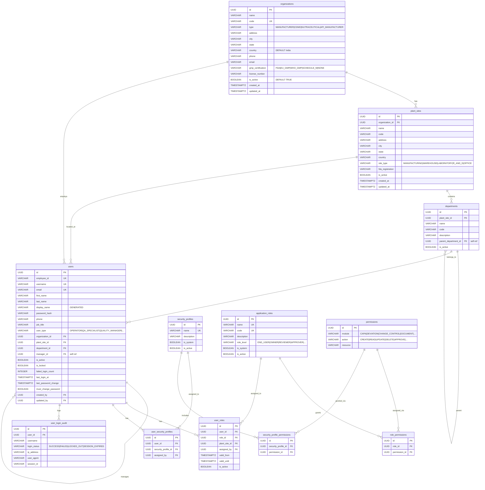

---

## 3. Deviation Management

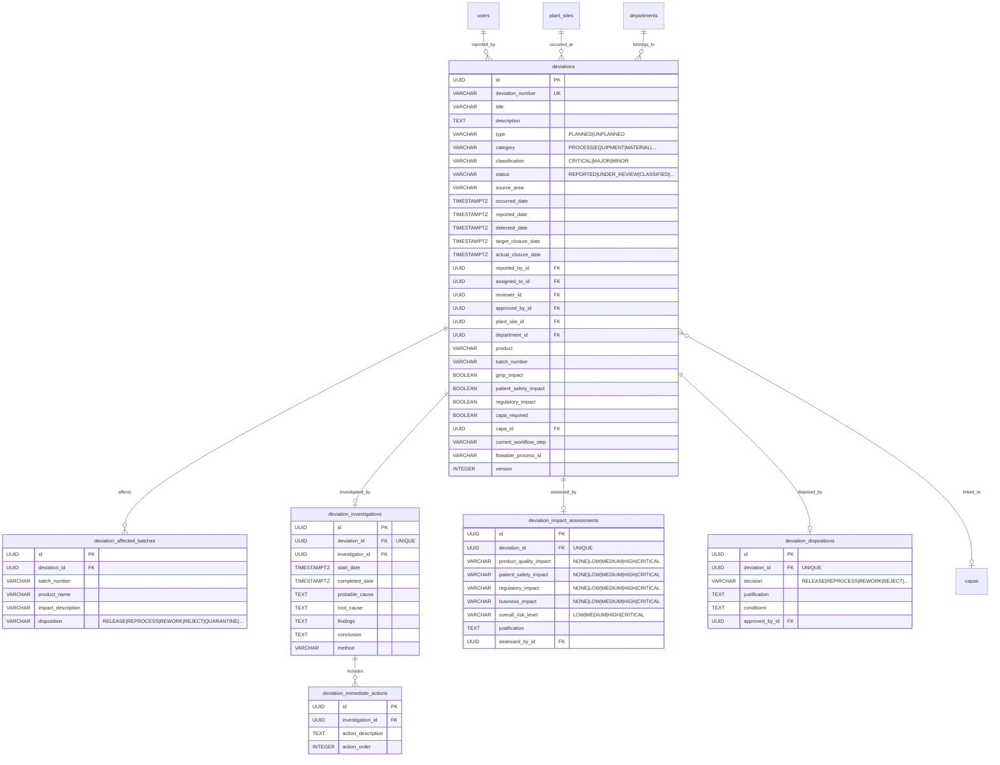

---

## 4. CAPA Management

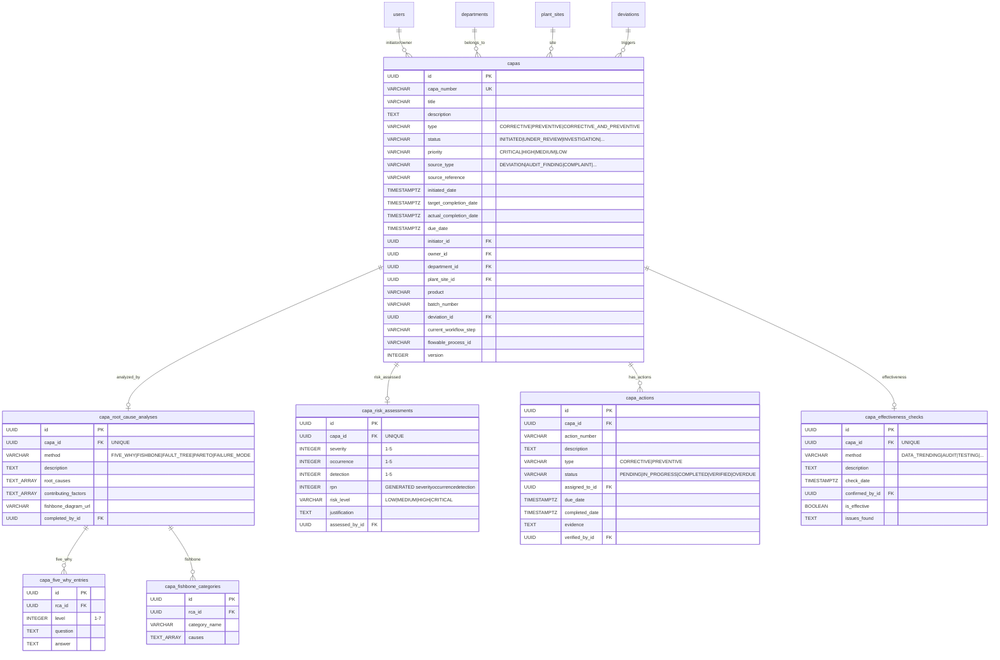

---

## 5. Change Control Management

```mermaid
erDiagram
    change_requests {
        UUID id PK
        VARCHAR change_number UK
        VARCHAR title
        TEXT description
        TEXT reason
        VARCHAR type "ENGINEERING|BUSINESS|PROCESS|SITE|PRODUCT"
        VARCHAR impact_level "NO_IMPACT|LOW|MEDIUM|HIGH|CRITICAL"
        VARCHAR status "INITIATED|UNDER_REVIEW|AWAITING_APPROVAL|..."
        VARCHAR priority "CRITICAL|HIGH|MEDIUM|LOW"
        VARCHAR change_category "PREVENTIVE|CORRECTIVE|IMPROVEMENT|..."
        TIMESTAMPTZ target_implementation_date
        TIMESTAMPTZ actual_implementation_date
        TEXT justification
        UUID initiator_id FK
        UUID owner_id FK
        UUID department_id FK
        UUID plant_site_id FK
        VARCHAR current_workflow_step
        VARCHAR flowable_process_id
        INTEGER version
    }

    change_impact_assessments {
        UUID id PK
        UUID change_id FK "UNIQUE"
        VARCHAR product_impact
        VARCHAR process_impact
        VARCHAR equipment_impact
        VARCHAR documentation_impact
        BOOLEAN training_required
        BOOLEAN regulatory_filing_required
        DECIMAL cost_estimate
        TEXT assessment_summary
        UUID assessed_by_id FK
    }

    change_regulatory_filings {
        UUID id PK
        UUID change_id FK
        VARCHAR filing_type "IND|BLA|ANDA|NDA|DMF|ANNUAL_REPORT"
        VARCHAR regulatory_body
        VARCHAR status "SUBMITTED|ACCEPTED|APPROVED|REJECTED|..."
    }

    change_affected_documents {
        UUID id PK
        UUID change_id FK
        UUID document_id FK
        VARCHAR action "CREATE|UPDATE|REVOKE|ARCHIVE"
    }

    change_affected_products {
        UUID id PK
        UUID change_id FK
        VARCHAR product_name
        VARCHAR market "DOMESTIC|EXPORT|USA|EU|OTHER"
        TEXT impact_description
    }

    change_implementation_tasks {
        UUID id PK
        UUID change_id FK
        TEXT task_description
        UUID assigned_to_id FK
        TIMESTAMPTZ due_date
        TIMESTAMPTZ completed_date
        VARCHAR status "PENDING|IN_PROGRESS|COMPLETED|OVERDUE|ON_HOLD"
        INTEGER percentage_complete
    }

    change_training_requirements {
        UUID id PK
        UUID change_id FK
        TEXT training_scope
        TEXT_ARRAY affected_roles
        VARCHAR training_type
        VARCHAR status "PLANNED|IN_PROGRESS|COMPLETED|DEFERRED"
    }

    change_approvals {
        UUID id PK
        UUID change_id FK
        UUID approver_id FK
        VARCHAR role
        INTEGER approval_order
        VARCHAR decision "PENDING|APPROVED|REJECTED|RETURNED"
        TEXT comments
    }

    change_effectiveness_reviews {
        UUID id PK
        UUID change_id FK "UNIQUE"
        TIMESTAMPTZ review_date
        UUID reviewer_id FK
        BOOLEAN is_effective
        TEXT issues_identified
    }

    change_effectiveness_criteria {
        UUID id PK
        UUID change_id FK
        TEXT criteria_description
        VARCHAR measurement_method
        VARCHAR expected_value
        VARCHAR actual_value
        BOOLEAN met
    }

    change_requests ||--o| change_impact_assessments : "assessed_by"
    change_requests ||--o{ change_regulatory_filings : "filed"
    change_requests ||--o{ change_affected_documents : "affects_docs"
    change_requests ||--o{ change_affected_products : "affects_products"
    change_requests ||--o{ change_implementation_tasks : "tasks"
    change_requests ||--o{ change_training_requirements : "training"
    change_requests ||--o{ change_approvals : "approved_by"
    change_requests ||--o| change_effectiveness_reviews : "reviewed"
    change_requests ||--o{ change_effectiveness_criteria : "criteria"
    users ||--o{ change_requests : "initiator/owner"
    departments ||--o{ change_requests : "dept"
    plant_sites ||--o{ change_requests : "site"
```

---

## 6. Document Management

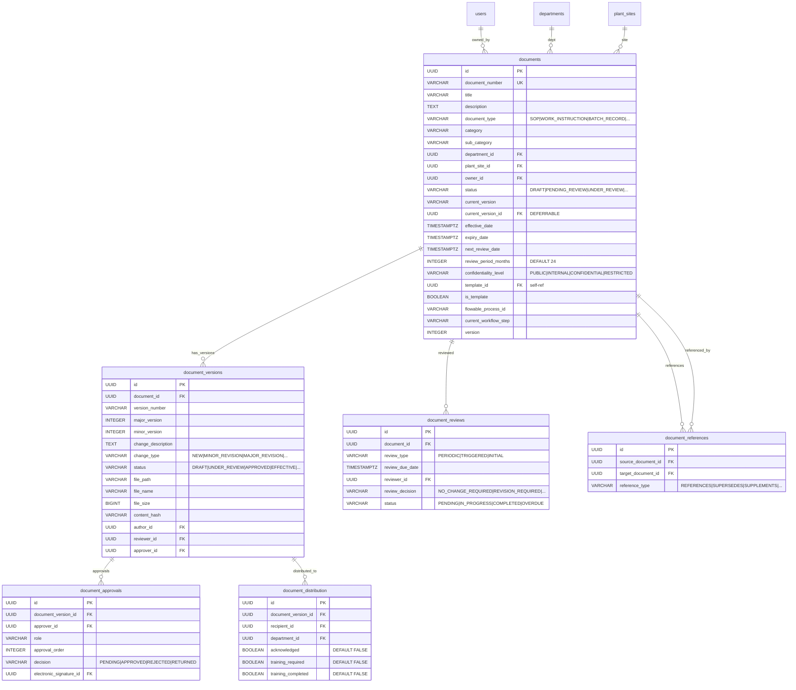

---

## 7. Training Management

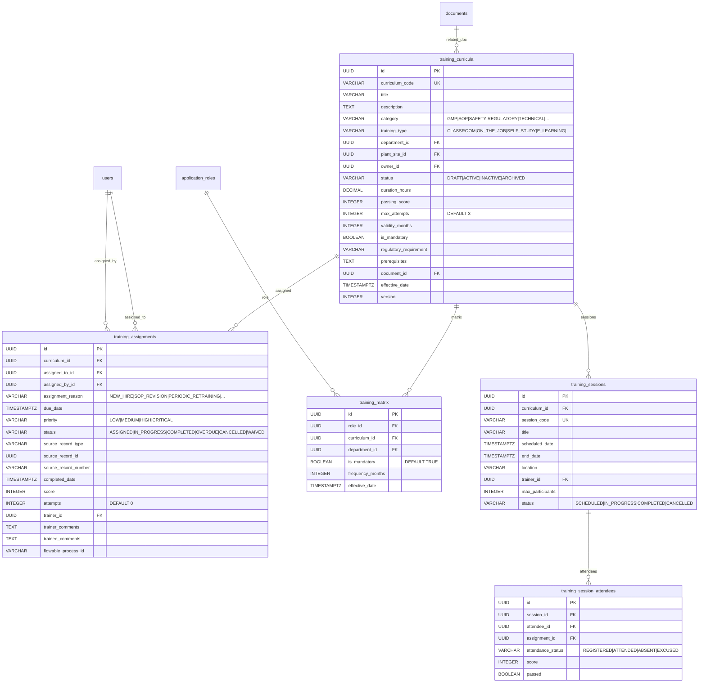

---

## 8. Risk Management

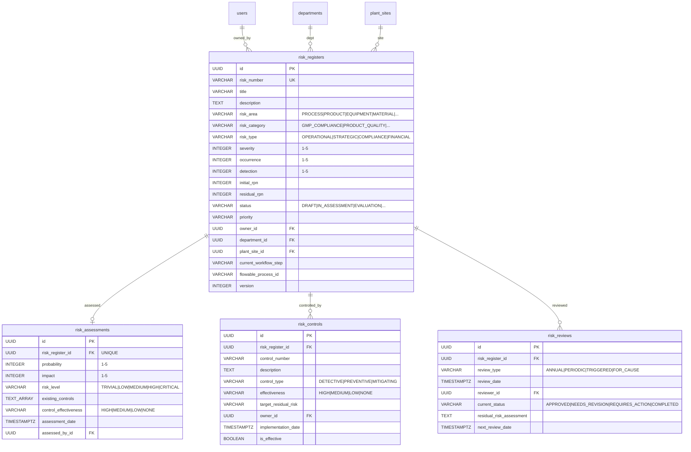

---

## 9. Audit Management

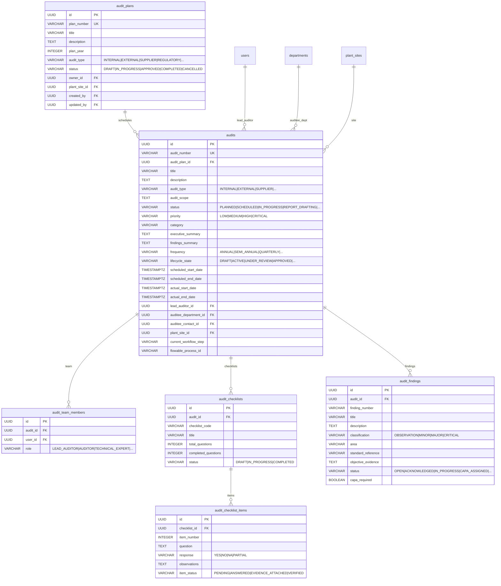

---

## 10. Supplier Management

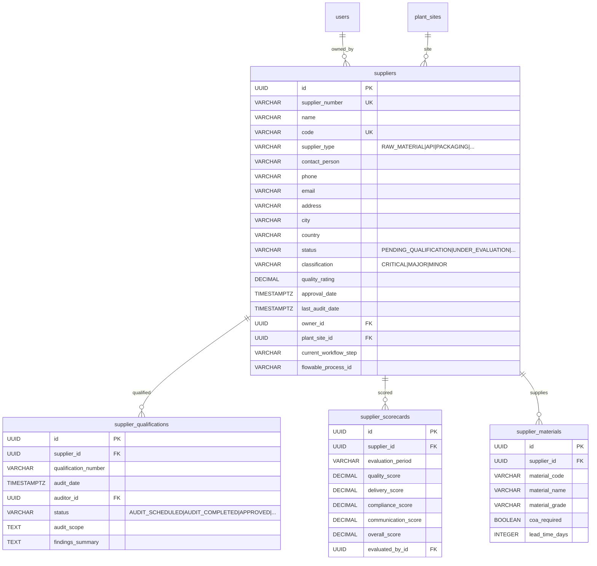

---

## 11. Complaint Management

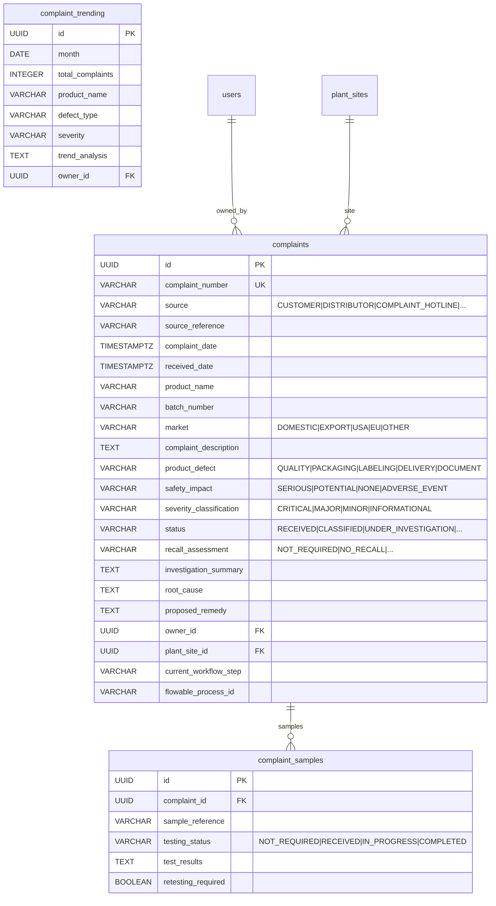

---

## 12. Nonconformance Management

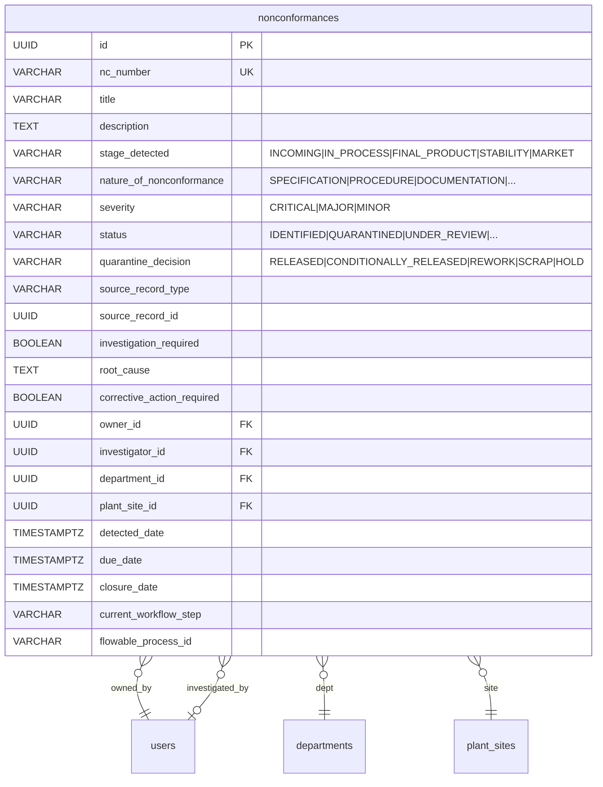

---

## 13. Equipment Management

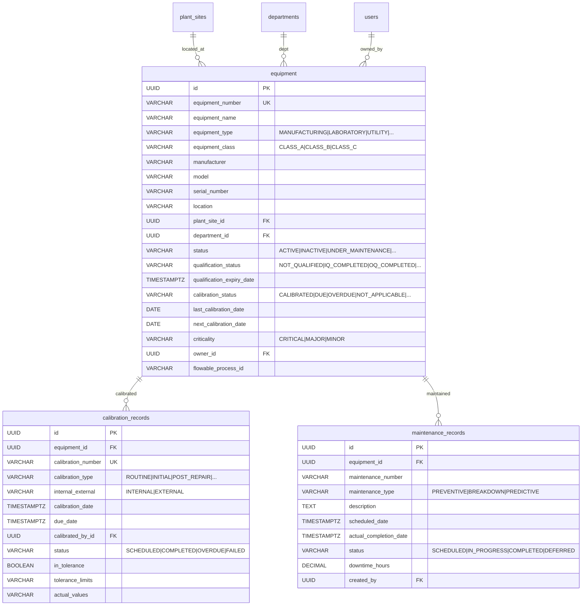

---

## 14. Validation & Management Review

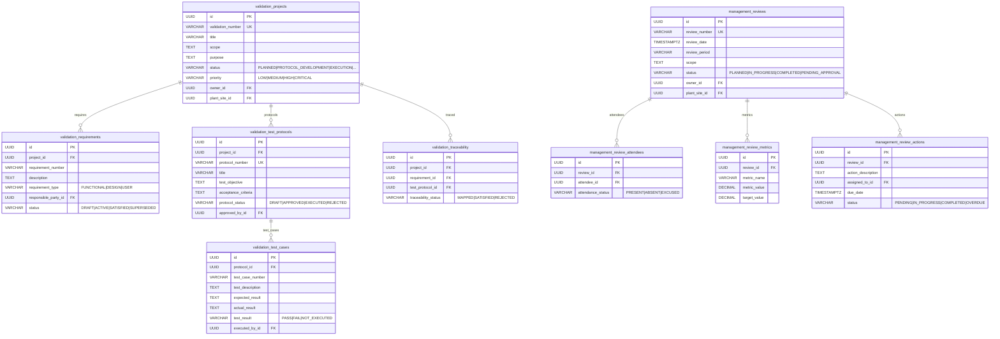

---

## 15. System & Shared Tables

```mermaid
erDiagram
    electronic_signatures {
        UUID id PK
        UUID user_id FK
        VARCHAR record_type
        UUID record_id
        VARCHAR action
        VARCHAR meaning
        VARCHAR signature_hash
        TIMESTAMPTZ signed_at
        BOOLEAN is_valid
        UUID invalidated_by FK
    }

    audit_trail {
        UUID id PK
        VARCHAR record_type
        UUID record_id
        VARCHAR action
        UUID changed_by FK
        TIMESTAMPTZ changed_at
        TEXT old_value
        TEXT new_value
        TEXT description
    }

    workflow_history {
        UUID id PK
        VARCHAR record_type
        UUID record_id
        VARCHAR process_key
        VARCHAR task_id
        VARCHAR task_key
        VARCHAR task_name
        UUID assignee_id FK
        UUID actor_id FK
        VARCHAR action
        VARCHAR old_status
        VARCHAR new_status
        TIMESTAMPTZ timestamp
        TEXT comment
    }

    attachments {
        UUID id PK
        VARCHAR record_type
        UUID record_id
        VARCHAR filename
        VARCHAR file_path
        BIGINT file_size
        UUID uploaded_by FK
        UUID parent_attachment_id FK "self-ref"
    }

    record_comments {
        UUID id PK
        VARCHAR record_type
        UUID record_id
        TEXT comment_text
        UUID created_by FK
    }

    notifications {
        UUID id PK
        VARCHAR notification_type
        UUID recipient_id FK
        VARCHAR subject
        TEXT message
        VARCHAR related_record_type
        UUID related_record_id
        BOOLEAN is_read
    }

    sequence_counters {
        UUID id PK
        VARCHAR sequence_name
        INTEGER year
        INTEGER current_value
        VARCHAR prefix
        VARCHAR format_pattern
        UUID plant_site_id FK
    }

    system_configurations {
        UUID id PK
        VARCHAR config_key UK
        TEXT config_value
        VARCHAR config_type
        BOOLEAN is_active
    }

    lookup_values {
        UUID id PK
        VARCHAR lookup_type
        VARCHAR lookup_code
        VARCHAR lookup_value
        INTEGER display_order
        BOOLEAN is_active
    }

    products {
        UUID id PK
        VARCHAR product_code UK
        VARCHAR product_name
        VARCHAR product_form "TABLET|CAPSULE|INJECTION|..."
        VARCHAR strength
        VARCHAR regulatory_classification "DRUG|NUTRACEUTICAL|COSMETIC"
        UUID manufacturer_id FK
        UUID plant_site_id FK
    }

    batches {
        UUID id PK
        VARCHAR batch_number
        UUID product_id FK
        DECIMAL batch_size
        DATE mfg_date
        DATE expiry_date
        BOOLEAN recalled
        VARCHAR stability_status "ONGOING|COMPLETED|FAILED"
    }

    regulatory_inspections {
        UUID id PK
        VARCHAR inspection_number UK
        TIMESTAMPTZ inspection_date
        VARCHAR regulatory_body
        VARCHAR inspection_type "ROUTINE|FOR_CAUSE|COURTESY|VOLUNTARY"
        VARCHAR outcome "ACCEPTABLE|ACCEPTABLE_WITH_COMMENTS|UNACCEPTABLE"
        UUID plant_site_id FK
    }

    regulatory_observations {
        UUID id PK
        UUID inspection_id FK
        VARCHAR observation_number
        TEXT description
        VARCHAR severity "CRITICAL|MAJOR|MINOR|INFORMATIONAL"
        VARCHAR response_status "PENDING|SUBMITTED|ACCEPTED|..."
    }

    regulatory_commitments {
        UUID id PK
        VARCHAR commitment_number UK
        TEXT commitment_description
        VARCHAR regulatory_body
        VARCHAR status "PENDING|IN_PROGRESS|COMPLETED|EXTENDED|CLOSED"
        UUID owner_id FK
        UUID plant_site_id FK
    }

    periodic_reviews {
        UUID id PK
        VARCHAR review_number UK
        UUID product_id FK
        VARCHAR review_period
        VARCHAR status "DRAFT|IN_PROGRESS|COMPLETED|APPROVED"
        UUID owner_id FK
        UUID plant_site_id FK
    }

    quality_metric_snapshots {
        UUID id PK
        VARCHAR metric_name
        DECIMAL metric_value
        UUID plant_site_id FK
        DATE snapshot_date
    }

    users ||--o{ electronic_signatures : "signs"
    users ||--o{ audit_trail : "changed_by"
    users ||--o{ notifications : "receives"
    users ||--o{ attachments : "uploads"
    users ||--o{ record_comments : "comments"
    products ||--o{ batches : "produced"
    regulatory_inspections ||--o{ regulatory_observations : "findings"
```

---

## 16. Complete Foreign Key Reference

### Cross-Domain Relationships

| Source Table | Column | References | Target Table | Relationship |
|---|---|---|---|---|
| `deviations` | `capa_id` | → | `capas.id` | Deviation triggers CAPA |
| `capas` | `deviation_id` | → | `deviations.id` | CAPA sourced from Deviation |
| `change_affected_documents` | `document_id` | → | `documents.id` | Change affects Document |
| `training_curricula` | `document_id` | → | `documents.id` | Curriculum uses Document |
| `document_distribution` | `recipient_id` | → | `users.id` | Document distributed to User |
| `training_session_attendees` | `assignment_id` | → | `training_assignments.id` | Session links to Assignment |
| `audit_findings` | `capa_id` | → | `capas.id` | Finding triggers CAPA |

### All Tables by Domain (70 tables)

| Domain | Tables | Count |
|---|---|---|
| **Core/Auth** | organizations, plant_sites, departments, users, security_profiles, application_roles, permissions, role_permissions, user_roles, user_security_profiles, security_profile_permissions, user_login_audit | 12 |
| **21 CFR Part 11** | electronic_signatures, audit_trail, workflow_history | 3 |
| **Deviation** | deviations, deviation_affected_batches, deviation_investigations, deviation_immediate_actions, deviation_impact_assessments, deviation_dispositions | 6 |
| **CAPA** | capas, capa_root_cause_analyses, capa_five_why_entries, capa_fishbone_categories, capa_risk_assessments, capa_actions, capa_effectiveness_checks | 7 |
| **Change Control** | change_requests, change_impact_assessments, change_regulatory_filings, change_affected_documents, change_affected_products, change_implementation_tasks, change_training_requirements, change_approvals, change_effectiveness_reviews, change_effectiveness_criteria | 10 |
| **Document** | documents, document_versions, document_reviews, document_approvals, document_distribution, document_references | 6 |
| **Training** | training_curricula, training_assignments, training_matrix, training_sessions, training_session_attendees | 5 |
| **Risk** | risk_registers, risk_assessments, risk_controls, risk_reviews | 4 |
| **Audit** | audit_plans, audits, audit_team_members, audit_checklists, audit_checklist_items, audit_findings | 6 |
| **Supplier** | suppliers, supplier_qualifications, supplier_scorecards, supplier_materials | 4 |
| **Complaint** | complaints, complaint_samples, complaint_trending | 3 |
| **Nonconformance** | nonconformances | 1 |
| **Equipment** | equipment, calibration_records, maintenance_records | 3 |
| **Validation** | validation_projects, validation_requirements, validation_test_protocols, validation_test_cases, validation_traceability | 5 |
| **Management Review** | management_reviews, management_review_attendees, management_review_metrics, management_review_actions | 4 |
| **Regulatory** | regulatory_inspections, regulatory_observations, regulatory_commitments | 3 |
| **System/Shared** | attachments, record_comments, notifications, sequence_counters, system_configurations, lookup_values, products, batches, periodic_reviews, quality_metric_snapshots | 10 |

### Shared Pattern: `users` FK References

Nearly every domain table references `users` for ownership, assignment, and audit fields:

| Pattern | Columns | Used In |
|---|---|---|
| **Ownership** | `owner_id`, `initiator_id` | capas, deviations, change_requests, documents, risk_registers, audits, suppliers, complaints |
| **Assignment** | `assigned_to_id`, `lead_auditor_id`, `investigator_id` | deviations, capa_actions, audits, training_assignments |
| **Review/Approval** | `reviewer_id`, `approver_id`, `approved_by_id`, `assessed_by_id` | deviations, documents, change_approvals, capa_risk_assessments |
| **Audit Fields** | `created_by`, `updated_by` | All main record tables |

### Shared Pattern: `plant_sites` and `departments`

All major record tables include `plant_site_id` (FK to `plant_sites`) and most include `department_id` (FK to `departments`) for organizational scoping.

### Flowable Workflow Fields

Tables with BPMN workflow integration:

| Table | Fields |
|---|---|
| `deviations` | `flowable_process_id`, `current_workflow_step` |
| `capas` | `flowable_process_id`, `current_workflow_step` |
| `change_requests` | `flowable_process_id`, `current_workflow_step` |
| `documents` | `flowable_process_id`, `current_workflow_step` |
| `training_assignments` | `flowable_process_id` |
| `risk_registers` | `flowable_process_id`, `current_workflow_step` |
| `audits` | `flowable_process_id`, `current_workflow_step` |
| `suppliers` | `flowable_process_id`, `current_workflow_step` |
| `complaints` | `flowable_process_id`, `current_workflow_step` |
| `nonconformances` | `flowable_process_id`, `current_workflow_step` |
| `equipment` | `flowable_process_id` |
